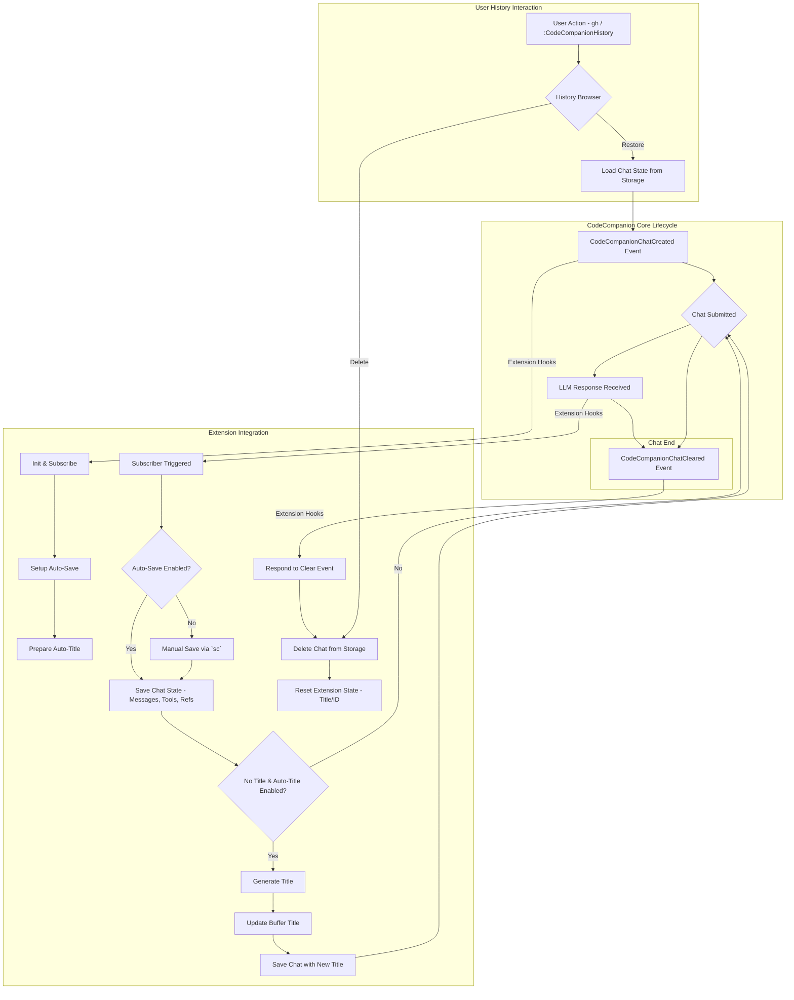

# CodeCompanion History Extension

[](https://neovim.io)
[](https://www.lua.org)
[](https://github.com/ravitemer/codecompanion-history.nvim/actions)
[](https://opensource.org/licenses/MIT)
[](./CONTRIBUTING.md)

A history management extension for [codecompanion.nvim](https://codecompanion.olimorris.dev/) that enables saving, browsing and restoring chat sessions.


<p>
    <video controls muted src="https://github.com/user-attachments/assets/04a6ad1f-8351-4381-ae60-00c352a1670c"></video>
</p>

## ✨ Features

### 💾 Chat Management
- **Flexible chat saving**: Automatic session saving (can be disabled) + manual save with dedicated keymap
- **Smart title generation**: Auto-generate meaningful titles for chats
- **Continue conversations**: Resume from where you left off
- **Browse with preview**: Navigate saved chats with content preview
- **Multiple picker interfaces**: Telescope, Snacks, FZF-Lua, and default vim.ui.select
- **Optional chat expiration**: Automatically clean up old chats
- **Complete session restoration**: Restore with full context and tools state

### 📝 Summary System
- **Manual summary generation**: Create summaries for any chat with `gcs`
- **Intelligent content processing**: Extracts meaningful conversation content while filtering noise
- **Chunked summarization**: Handles large conversations by splitting into manageable chunks
- **Customizable generation**: Configure adapter, model, and system prompts
- **Rich metadata**: Includes chat title, project root, and generation timestamps
- **Summary browsing**: Dedicated browser with `gbs` to explore all summaries
- **In-editor editing**: Preview and edit summaries with `gps` in main editor
- **Visual indicators**: Chats with summaries show 📝 icon in history browser

The following CodeCompanion features are preserved when saving and restoring chats:

| Feature | Status | Notes |
|---------|--------|-------|
|  System Prompts | ✅  | System prompt used in the chat |
|  Messages History | ✅  | All messages |
|  Images | ✅  | Restores images as base64 strings |
|  LLM Adapter | ✅  | The specific adapter used for the chat |
|  LLM Settings | ✅  | Model, temperature and other adapter settings |
|  Tools | ✅  | Tool schemas and their system prompts |
|  Tool Outputs | ✅  | Tool execution results |
|  Variables | ✅  | Variables used in the chat |
|  References | ✅  | Code snippets and command outputs added via slash commands |
|  Pinned References | ✅  | Pinned references |
|  Watchers | ⚠  | Saved but requires original buffer context to resume watching |

When restoring a chat:
1. The complete message history is recreated
2. All tools and references are reinitialized
3. Original LLM settings and adapter are restored
4. Previous system prompts are preserved

> **Note**: While watched buffer states are saved, they require the original buffer context to resume watching functionality.

> [!NOTE]
> As this is an extension that deeply integrates with CodeCompanion's internal APIs, occasional compatibility issues may arise when CodeCompanion updates. If you encounter any bugs or unexpected behavior, please [raise an issue](https://github.com/ravitemer/codecompanion-history.nvim/issues) to help us maintain compatibility.

## 📋 Requirements

- Neovim >= 0.8.0
- [codecompanion.nvim](https://codecompanion.olimorris.dev/)
- [snacks.nvim](https://github.com/folke/snacks.nvim) (optional, for enhanced picker)
- [telescope.nvim](https://github.com/nvim-telescope/telescope.nvim) (optional, for enhanced picker)
- [fzf-lua](https://github.com/ibhagwan/fzf-lua) (optional, for enhanced picker)

## 📦 Installation

Using [lazy.nvim](https://github.com/folke/lazy.nvim):

### First install the plugin

```lua
{
    "olimorris/codecompanion.nvim",
    dependencies = {
        --other plugins
        "ravitemer/codecompanion-history.nvim"
    }
}
```

### Add history extension to CodeCompanion config

```lua
require("codecompanion").setup({
    extensions = {
        history = {
            enabled = true,
            opts = {
                -- Keymap to open history from chat buffer (default: gh)
                keymap = "gh",
                -- Keymap to save the current chat manually (when auto_save is disabled)
                save_chat_keymap = "sc",
                -- Save all chats by default (disable to save only manually using 'sc')
                auto_save = true,
                -- Number of days after which chats are automatically deleted (0 to disable)
                expiration_days = 0,
                -- Picker interface (auto resolved to a valid picker)
                picker = "telescope", --- ("telescope", "snacks", "fzf-lua", or "default") 
                
                -- Title generation
                auto_generate_title = true,
                title_generation_opts = {
                    ---Adapter for generating titles (defaults to current chat adapter) 
                    adapter = nil, -- "copilot"
                    ---Model for generating titles (defaults to current chat model)
                    model = nil, -- "gpt-4o"
                    ---Number of user prompts after which to refresh the title (0 to disable)
                    refresh_every_n_prompts = 0, -- e.g., 3 to refresh after every 3rd user prompt
                    ---Maximum number of times to refresh the title (default: 3)
                    max_refreshes = 3,
                },
                
                -- Summary system
                summary = {
                    -- Keymap to generate summary (default: "gcs")
                    create_summary_keymap = "gcs",
                    -- Keymap to browse summaries (default: "gbs")
                    browse_summaries_keymap = "gbs",
                    -- Keymap to preview/edit summary (default: "gps")
                    preview_summary_keymap = "gps",
                    
                    generation_opts = {
                        adapter = nil, -- defaults to current chat adapter
                        model = nil, -- defaults to current chat model
                        context_size = 90000, -- max tokens for summarization
                        include_references = true, -- include slash command content
                        include_tool_outputs = true, -- include tool execution results
                        system_prompt = nil, -- custom system prompt (string or function)
                    },
                },
                
                -- Other options
                continue_last_chat = false,
                delete_on_clearing_chat = false,
                dir_to_save = vim.fn.stdpath("data") .. "/codecompanion-history",
                enable_logging = false,
            }
        }
    }
})
```

## 🛠️ Usage

#### 🎯 Commands

- `:CodeCompanionHistory` - Open the history browser
- `:CodeCompanionSummaries` - Browse all summaries


#### ⌨️ Chat Buffer Keymaps

**History Management:**
- `gh` - Open history browser (customizable via `opts.keymap`)
- `sc` - Save current chat manually (customizable via `opts.save_chat_keymap`)

**Summary System:**
- `gcs` - Generate summary for current chat (customizable via `opts.summary.create_summary_keymap`)
- `gbs` - Browse saved summaries (customizable via `opts.summary.browse_summaries_keymap`)
- `gps` - Preview/edit summary for current chat (customizable via `opts.summary.preview_summary_keymap`)

#### 📚 History Browser

The history browser shows all your saved chats with:
- Title (auto-generated or custom)
- Summary indicator (📝 icon for chats with summaries)
- Token estimates and relative timestamps
- Preview of chat contents

Actions in history browser:
- `<CR>` - Open selected chat
- Normal mode:
  - `d` - Delete selected chat(s)
  - `r` - Rename selected chat
- Insert mode:
  - `<M-d>` (Alt+d) - Delete selected chat(s)
  - `<M-r>` (Alt+r) - Rename selected chat

#### 📝 Summary Browser

The summary browser shows all your generated summaries with:
- Chat title (from original conversation)
- Project context and relative timestamps
- Preview of summary content

Actions in summary browser:
- `<CR>` - Open associated chat
- Delete/rename actions (same as history browser)

#### ✏️ Summary Editing

When you press `gps` on a chat with a summary:
- Opens the summary markdown file in your main editor
- Full editing capabilities with syntax highlighting
- Save with `:w` as usual
- Automatically updates summary storage

> Note: Delete and rename actions are only available in telescope and snacks pickers. Multiple items can be selected for deletion using picker's multi-select feature (press `<Tab>`).

#### 🔄 Title Refresh Feature

The extension can automatically refresh chat titles as conversations evolve:

- **`refresh_every_n_prompts`**: Set to refresh the title after every N user prompts (e.g., 3 means refresh after the 3rd, 6th, 9th user message)
- **`max_refreshes`**: Limits how many times a title can be refreshed to avoid excessive API calls
- When refreshing, the system considers recent conversation context (both user and assistant messages) and the original title
- Individual messages are truncated at 1000 characters with a `[truncated]` indicator
- Total conversation context is limited to 10,000 characters with a `[conversation truncated]` indicator

Example configuration for title refresh:
```lua
title_generation_opts = {
    refresh_every_n_prompts = 3, -- Refresh after every 3rd user prompt
    max_refreshes = 10,           -- Allow up to 10 refreshes per chat
}
```

#### 🔧 API

The history extension exports the following functions that can be accessed via `require("codecompanion").extensions.history`:

```lua
-- Chat Management
get_location(): string?                           -- Get storage location
save_chat(chat?: CodeCompanion.Chat)             -- Save chat to storage
get_chats(): table<string, ChatIndexData>        -- Get all chat metadata
load_chat(save_id: string): ChatData?            -- Load specific chat
delete_chat(save_id: string): boolean            -- Delete chat

-- Summary Management  
generate_summary(chat?: CodeCompanion.Chat)      -- Generate summary for chat
preview_summary(chat?: CodeCompanion.Chat)       -- Preview/edit summary
get_summaries(): table<string, SummaryIndexData> -- Get all summary metadata
load_summary(summary_id: string): string?        -- Load summary content
```

Example usage:
```lua
local history = require("codecompanion").extensions.history

-- Chat operations
local chats = history.get_chats()
local chat_data = history.load_chat("some_save_id")
history.delete_chat("some_save_id")

-- Summary operations
history.generate_summary() -- generates for current chat
local summaries = history.get_summaries()
local summary_content = history.load_summary("some_save_id")
history.preview_summary() -- opens summary for editing
```

## The `@memory` tool

If you have installed [VectorCode](https://github.com/Davidyz/VectorCode), this
plugin will use VectorCode to create an index for your chat summaries and create
a tool called `@memory`. This tool gives the LLM the ability to search for
(the summary of) previous chats so that you can refer to them in a new chat.

## ⚙️ How It Works




Here's what's happening in simple terms:

1. When you create a new chat, our extension jumps in and sets up two things:
   - An autosave system that will save your chat
   - A title generator that will name your chat based on the conversation

2. As you chat:
   - When auto-save is enabled (default):
     - Each submitted message triggers automatic saving
     - Every LLM response automatically saves the chat state
   - Manual saving is available via the `sc` keymap
   - If your chat doesn't have a title yet, it tries to create one that makes sense
   - All your messages, tools, and references are safely stored

3. When you clear a chat:
   - Our extension knows to remove it from storage (if configured)
   - This keeps your history clean and organized

4. Any time you want to look at old chats:
   - Use `gh` or the command to open the history browser
   - Pick any chat to restore it completely
   - Or remove ones you don't need anymore

<details>
    <summary> Technical details </summary>

The extension integrates with CodeCompanion through a robust event-driven architecture:

1. **Initialization and Storage Management**:
   - Uses a dedicated Storage class to manage chat persistence in `{data_path}/codecompanion-history/`
   - Maintains an index.json for metadata and individual JSON files for each chat
   - Implements file I/O operations with error handling and atomic writes

2. **Chat Lifecycle Integration**:
   - Hooks into `CodeCompanionChatCreated` event to:
     - Generate unique save_id (Unix timestamp)
     - Initialize chat subscribers for auto-saving
     - Set initial buffer title with sparkle icon (✨)

   - Monitors `CodeCompanionChatSubmitted` events to:
     - Persist complete chat state including messages, tools, schemas, and references
     - Trigger title generation if enabled and title is empty
     - Update buffer title with relative timestamps

3. **Title Generation System**:
   - Uses the chat's configured LLM adapter for title generation
   - Implements smart content truncation (1000 chars) and prompt engineering
   - Handles title collisions with automatic numbering
   - Updates titles asynchronously using vim.schedule

4. **State Management**:
   - Preserves complete chat context including:
     - Message history with role-based organization
     - Tool states and schemas
     - Reference management
     - Adapter configurations
     - Custom settings

5. **UI Components**:
   - Implements multiple picker interfaces (telescope/snacks/default)
   - Provides real-time preview generation with markdown formatting
   - Supports justified text layout for buffer titles
   - Handles window/buffer lifecycle management

6. **Data Flow**:
   - Chat data follows a structured schema (ChatData)
   - Implements proper serialization/deserialization
   - Maintains backward compatibility with existing chats
   - Provides error handling for corrupt or missing data

</details>

## 🔮 Future Roadmap


### Upcoming Features
- [ ] Auto-summary generation options
- [ ] Summary search and filtering
- [ ] Integration with vector databases

## 🔌 Related Extensions

- [MCP Hub](https://codecompanion.olimorris.dev/extensions/mcphub.html) extension
- [VectorCode](https://codecompanion.olimorris.dev/extensions/vectorcode.html) extension

## 🙏 Acknowledgements

Special thanks to [Oli Morris](https://github.com/olimorris) for creating the amazing [CodeCompanion.nvim](https://codecompanion.olimorris.dev) plugin - a highly configurable and powerful coding assistant for Neovim.

## 📄 License

MIT
